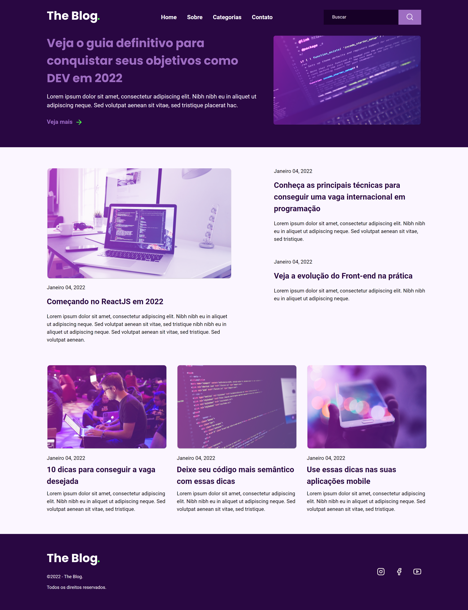

# The Blog Website

Minimalist and modern technology blog based o Rocketseat project.

## Used Stack

**Front-end:** HTML, CSS and Javascript

## Deploy

View the site online: https://xandekoch.github.io/the-blog/

## Screenshots

## Documentação de cores

| Cor               | Hexadecimal                                                |
| ----------------- | ---------------------------------------------------------------- |
| purple-bg         |  #290742 |
| dark-bg           |  #170027 |
| button-bg         |  #9e6dc2 |
| light-purple      |  #fbf6ff |
| green             |  #4fff4b |

## Roadmap

- Add a Backend System to Generate Content

- Create the sectors: about, categories and contact.

## Referência

 - [Rocketseat Figma Project](https://efficient-sloth-d85.notion.site/Desafio-RocketBlog-807e38809814423e80469b080444db5e)

## Feedback

If you have any feedback, please let me know via xandekoch.work@gmail.com

